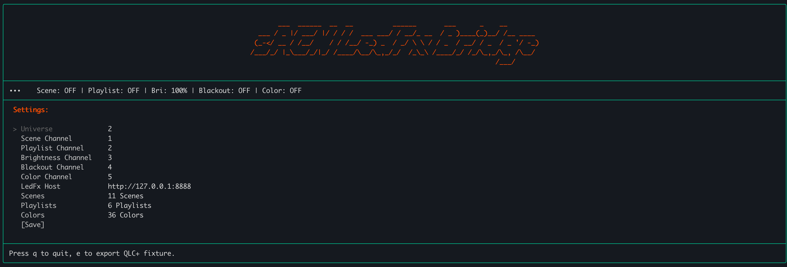

# sACN ledfx Bridge

> **⚠️ Disclaimer:** This fork is shamelessly vibecoded on top of [8-Lambda-8's original](https://github.com/8-Lambda-8/sACN_ledfx_bridge). It might only work on my machine 😉

Control [LedFx](https://github.com/LedFx/LedFx) scenes, playlists, effects, brightness, and more via sACN/DMX — designed for live shows with [QLC+](https://www.qlcplus.org/).

## What's different in this fork?

The [original by 8-Lambda-8](https://github.com/8-Lambda-8/sACN_ledfx_bridge) has a single DMX channel for scene selection. This fork turns it into a full 14-channel live show controller:

### New DMX channels
- **Playlist control** — start/stop LedFx playlists via DMX (mutually exclusive with scenes)
- **Effect type override** — switch the effect running on all [virtuals](https://docs.ledfx.app/en/latest/howto/virtuals.html) via DMX, bypassing scenes/playlists
- **Effect speed / sensitivity** — per-virtual config update controlling audio reactivity
- **Transition speed** — per-virtual config update controlling effect blend timing
- **Color / Gradient palette** — merged channel: preset colors use [`force_color`](https://docs.ledfx.app/en/latest/apis/api.html), gradients use [`apply_global gradient`](https://docs.ledfx.app/en/v2.1.2/apis/global.html)
- **RGB color override** — 3-channel RGB mixer sending arbitrary hex to `force_color` (QLC+ auto-shows a color picker!)
- **Brightness control** — global brightness via [`PUT /api/config`](https://docs.ledfx.app/en/latest/apis/api.html)
- **Brightness duck (sidechain)** — multiplier fader for moving-head interaction (beam fires → LEDs dim, beam off → LEDs restore)
- **Freeze / hold** — hold current LED visual state by setting effect sensitivity to 0
- **Strobe / flash** — force all LEDs white above DMX threshold; use QLC+ chaser for strobe effect
- **Blackout** — ultimate override, forces brightness to 0

### New features
- **14-channel QLC+ fixture generator** — export a self-documenting `.qxf` fixture definition from the TUI (press `e`), with `ColorMacro` swatches, `IntensityRed/Green/Blue` presets, and descriptive capabilities
- **One-key refresh** — press `r` in the TUI to load all scenes, playlists, effects, colors, and gradients from LedFx and save the config in one shot
- **Fixed 14-channel layout** — channel assignments are hardcoded and match the generated QXF fixture; no manual channel configuration needed
- **Full busking support** — effect type + gradient + speed + RGB gives complete improvised control without pre-built scenes
- **Non-blocking API calls** — each LedFx endpoint has its own worker goroutine with "latest value wins" coalescing; the sACN callback never blocks
- **First-frame sync** — on the first DMX packet, all channels are pushed to LedFx regardless of value (ensures LedFx state matches DMX on startup)
- **Immediate forwarding** — every new DMX value is forwarded instantly; duplicate values are silently ignored
- **Modular architecture** — separated into `bridge/`, `coalesce/`, `ledfx/`, and `tui/` packages with dependency injection and table-driven tests
- **Debug logging** — set `Debug: true` on the HTTP client to log all API calls with `→/✓/✗` indicators
- **Non-fatal error handling** — `log.Printf` instead of `log.Fatal` on API errors

### LedFx API endpoints used

| Endpoint | Method | Purpose |
|----------|--------|---------|
| [`/api/scenes`](https://docs.ledfx.app/en/latest/apis/scenes.html) | PUT | Activate/deactivate scenes |
| [`/api/playlists`](https://docs.ledfx.app/en/latest/apis/api.html) | PUT | Start/stop playlists |
| [`/api/config`](https://docs.ledfx.app/en/latest/apis/api.html) | PUT | Set global brightness |
| [`/api/effects`](https://docs.ledfx.app/en/v2.1.2/apis/global.html) | PUT | `apply_global` for gradient, brightness, flip, mirror |
| [`/api/virtuals/{id}/effects`](https://docs.ledfx.app/en/latest/apis/api.html) | PUT | Set effect type or update config (sensitivity, transition_time) per virtual |
| [`/api/virtuals_tools`](https://docs.ledfx.app/en/latest/apis/api.html) | PUT | `force_color` for solid colors, RGB hex, and strobe |
| [`/api/schema`](https://docs.ledfx.app/en/latest/apis/api.html) | GET | Load available effect types (from `effects` key) |
| [`/api/config`](https://docs.ledfx.app/en/latest/apis/api.html) | GET | Load user gradients (from `user_gradients` key) |
| [`/api/colors`](https://docs.ledfx.app/en/latest/apis/api.html) | GET | Load available color names + hex values |
| [`/api/virtuals`](https://docs.ledfx.app/en/latest/apis/api.html) | GET | Cache virtual IDs for effect/sensitivity updates |
| [`/api/scenes`](https://docs.ledfx.app/en/latest/apis/scenes.html) | GET | Load scene list |
| [`/api/playlists`](https://docs.ledfx.app/en/latest/apis/api.html) | GET | Load playlist list |


## Rewritten in GO
for old nodejs version go to [nodejs branch](https://github.com/8-Lambda-8/sACN_ledfx_bridge/tree/nodejs)

## Features

- **Scene Selection** — activate LedFx scenes by DMX channel value
- **Playlist Selection** — start/stop LedFx playlists by DMX channel value
- **Effect Type Override** — set the effect running on all virtuals, bypassing scenes/playlists
- **Transition Speed** — control blend timing between scenes/effects (0–5s)
- **Effect Speed / Sensitivity** — control how strongly effects react to audio
- **Color / Gradient** — preset palette selection (colors force solid, gradients change palette)
- **RGB Color Override** — 3-channel mixer for arbitrary colors (R, G, B)
- **Brightness Control** — set global LedFx brightness (0–255 → 0%–100%)
- **Brightness Duck** — sidechain dimmer for moving-head interaction
- **Freeze / Hold** — pause effects, hold current visual state
- **Strobe / Flash** — force all LEDs white (use QLC+ chaser for strobe)
- **Blackout** — instant blackout toggle, overrides everything

## DMX Channel Layout

The 14-channel layout is fixed and matches the generated QLC+ fixture definition. Channels are sorted by priority — higher channels override lower ones.

| Ch | Name | DMX Value | Action |
|----|------|-----------|--------|
| 1 | Scene Select | 0 | Deactivate current scene |
| | | 1–N | Activate scene N (stops active playlist) |
| 2 | Playlist Select | 0 | Stop current playlist |
| | | 1–N | Start playlist N (deactivates active scene) |
| 3 | Effect Type | 0 | No override (use current scene/playlist effect) |
| | | 1–N | Set effect type N on all virtuals |
| 4 | Transition Speed | 0–255 | Transition speed (0 = instant, 255 = 5s blend) |
| 5 | Effect Speed | 0 | Freeze (sensitivity = 0) |
| | | 1–255 | Audio sensitivity (1 = subtle, 255 = intense) |
| 6 | Color / Gradient | 0 | No override (use scene defaults) |
| | | 1–N | Force color N (solid color on all virtuals) |
| | | N+1–N+M | Apply gradient M (palette change on effects) |
| 7 | Red | 0–255 | Red component for RGB color override |
| 8 | Green | 0–255 | Green component for RGB color override |
| 9 | Blue | 0–255 | Blue component for RGB color override |
| 10 | Brightness | 0–255 | Set base brightness (value / 255) |
| 11 | Duck (Sidechain) | 0 | No ducking (full brightness) |
| | | 1–255 | Duck brightness (255 = fully dark, for beam cues) |
| 12 | Freeze / Hold | 0–127 | Normal (effects react to audio) |
| | | 128–255 | Freeze (hold current visual, ignore audio) |
| 13 | Strobe / Flash | 0–127 | Normal (no flash) |
| | | 128–255 | Flash (force all LEDs white) |
| 14 | Blackout | 0–127 | Normal operation |
| | | 128–255 | Blackout (force brightness to 0, overrides all) |

**Priority rules:**
- Blackout (ch 14) overrides everything
- Strobe (ch 13) overrides visual output when active
- Freeze (ch 12) overrides audio reactivity
- Duck (ch 11) multiplies brightness: `effective = brightness × (1 - duck/255)`
- RGB override (ch 7-9) takes precedence over palette preset (ch 6) when any R/G/B > 0
- Scene and playlist are mutually exclusive
- Effect type override bypasses scene/playlist effects
- All faders forward every new value immediately; duplicates are ignored

### Off states (DMX value 0)

| Channel | DMX 0 means |
|---------|-------------|
| Scene, Playlist, Effect, Palette | No override / deactivate |
| R + G + B (all three = 0) | Clear RGB override |
| Speed | Freeze (sensitivity = 0) |
| Transition | Instant (0s blend) |
| Duck | No ducking (full brightness) |
| **Brightness** | **Dark (0%) — standard DMX dimmer, always active** |
| Freeze, Strobe, Blackout | 0–127 = normal operation |

> **Note:** Brightness at 0 means LEDs are dark — this is standard DMX dimmer behavior.

## Configuration

```json
{
  "sAcnUniverse": 1,
  "scenes": ["beat-reactor", "cyberpunk-pulse", "..."],
  "playlists": ["ambient-mood", "party-mix", "..."],
  "effects": ["energy", "bars", "spectrum", "..."],
  "gradients": ["palette:cyberpunk", "palette:lava", "..."],
  "colors": ["red", "blue", "green", "..."],
  "ledfx_host": "http://127.0.0.1:8888"
}
```

Channel assignments are hardcoded (1–14) and match the generated QXF fixture — no manual configuration needed.

Press **`r`** in the TUI to load all scenes, playlists, effects, colors, and gradients from LedFx and save the config in one shot.

## New TUI



### Quick start with QLC+:
1. Start LedFx, QLC+, and sACN_ledfx_bridge on the same machine
2. In the bridge TUI, press **`r`** to load scenes/effects/colors from LedFx
3. Press **`e`** to export the QLC+ fixture definition (auto-installs to QLC+ fixtures folder)
4. Restart QLC+ → add the "LedFx sACN Bridge" fixture → patch to universe 1, channels 1–14
5. QLC+ settings:
   - 127.0.0.1 network, Multicast: off
   - Port: 5568 (Default), E1.31 Universe 1
   - Transmission Mode: Full, Priority: 100

